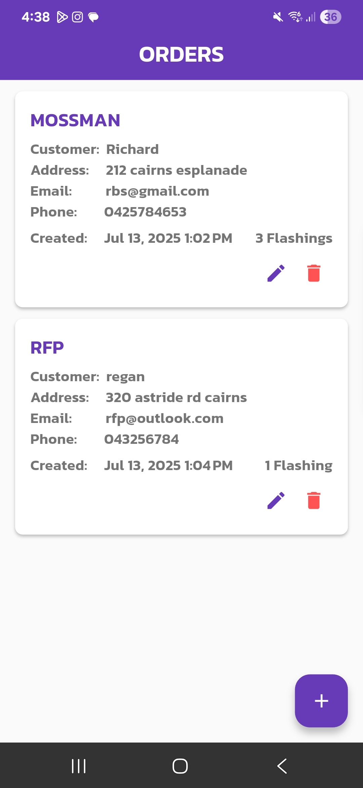
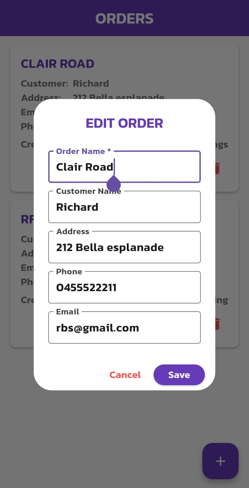
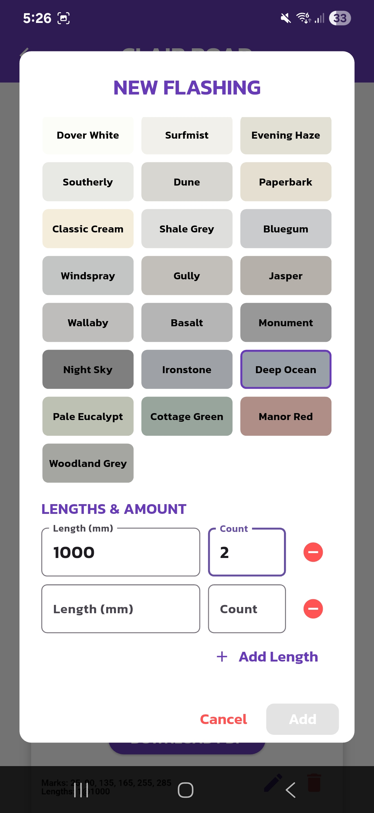
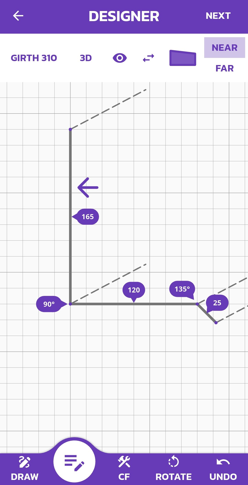
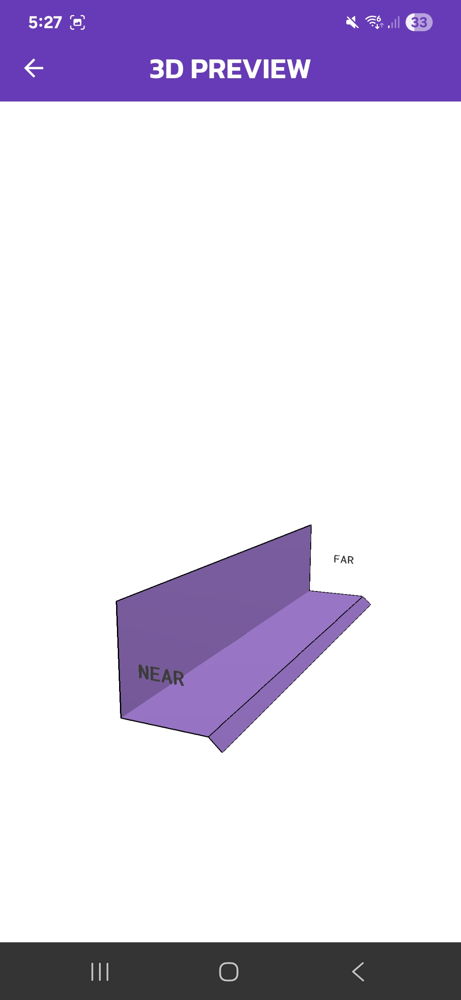
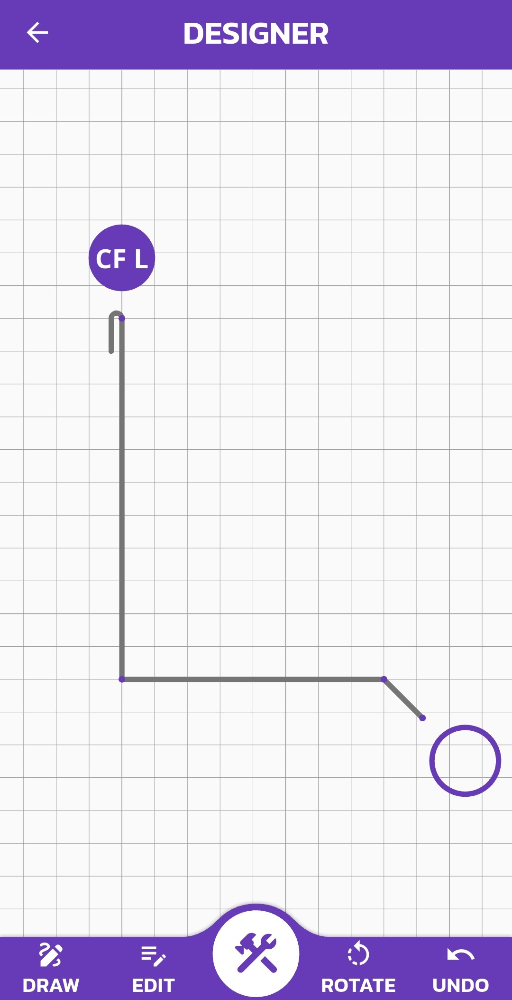
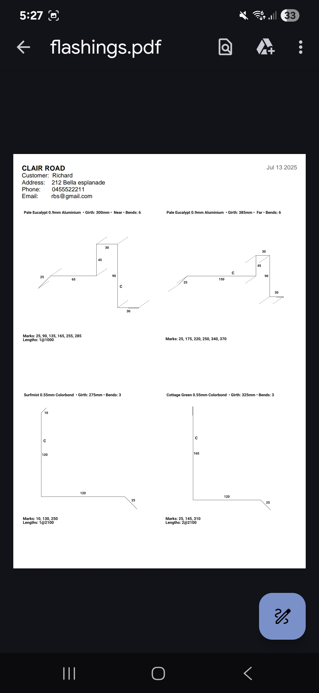

# Flashing Designer

A lightweight tool for creating, managing, and exporting custom metal flashing orders.

## Features

- **Materials**: Aluminium, Galvanised steel, Stainless steel, Colorbond®  
- **Thickness**: Specify custom thickness in millimetres  
- **Colours**: Full Colorbond® palette (when applicable)  
- **Dimensions**: Enter multiple length–count pairs  
- **Order Management**: Save, name and revisit orders; optional customer info  
- **PDF Export**: Generate print-ready layouts for easy sharing and printing  

## Screenshots

  
  
  
  
  
  
  
  

## Installation
